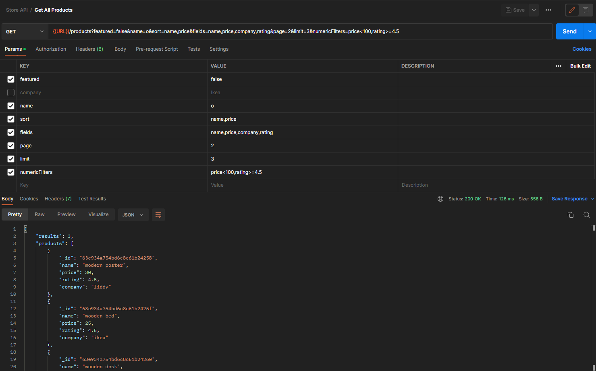

# store-api

A simple API for store products

#### What can be done with query params

- Filtering by product attributes _'e.g., featured=true&company=ikea'_
- Find products that includes specific characters _'e.g., name=table'_
- Sorting _'e.g., sort=name,-price'_
- Select specific attributes _'e.g., fields=name,price,rating'_
- Pagination _'e.g., page=3'_
- Limit products _'e.g., limit=5'_
- Numeric filtering _'e.g., numericFilters=price<100,rating>=4.5'_

#### Project Setup

- Create .env file, then set MONGO_URI variable equal to DB connection string
- Run `npm install`, then `npm start`
- You can also run `npm run productSeeder` to insert some products to DB

#### Postman Screenshot

